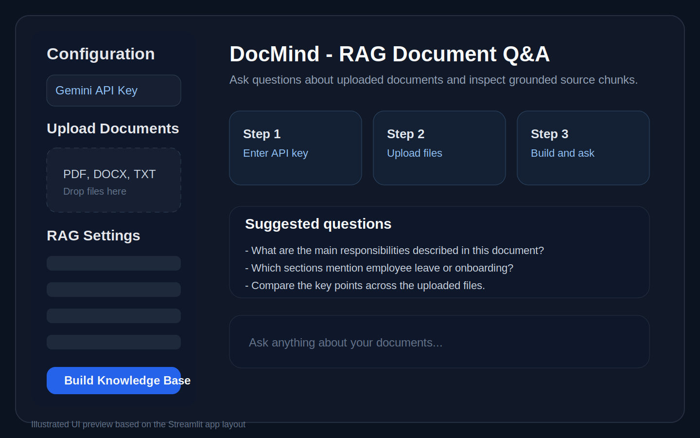
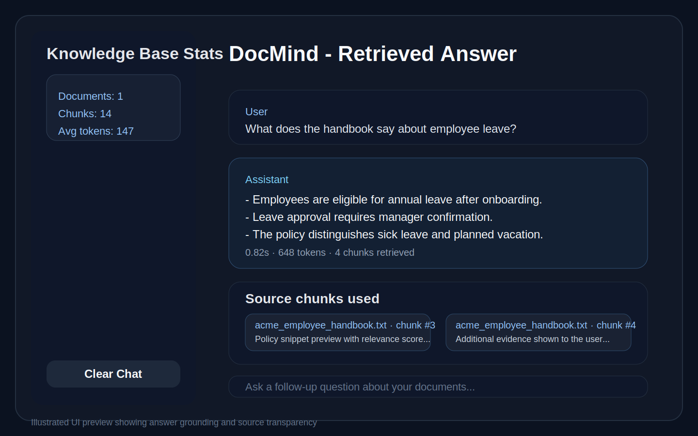
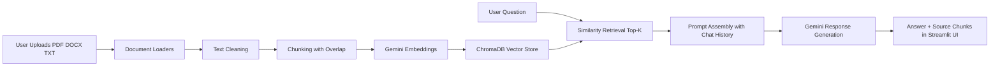

# RAG-Powered Document Q&A System

A recruiter-friendly demo of a practical Retrieval-Augmented Generation workflow: upload business documents, index them locally with vector search, and ask grounded questions through a polished Streamlit interface.

## Why This Project Stands Out

- Solves a real product problem: turning unstructured documents into a searchable Q&A experience
- Shows end-to-end LLM engineering, not just prompting
- Uses source-grounded retrieval to reduce hallucinations
- Balances UX, application logic, and AI integration in one portfolio project

## What This Demonstrates

- Building a multi-file ingestion pipeline for `PDF`, `DOCX`, and `TXT`
- Chunking and embedding documents for semantic retrieval
- Using `Gemini` for both embeddings and answer generation
- Persisting a local vector database with `ChromaDB`
- Designing a lightweight UI for demos, iteration, and explainability

## Screenshots

### App Overview



### Retrieved Answer With Sources



## Architecture Diagram



## Demo Highlights

- Upload multiple documents and turn them into a local knowledge base in one click
- Adjust `chunk size`, `chunk overlap`, `top-k retrieval`, and `Gemini model` directly from the sidebar
- Ask grounded natural-language questions against the indexed content
- Inspect the exact retrieved chunks used to answer each query
- Maintain short conversational continuity by including recent chat history in the prompt

## Overview

This app follows a practical RAG workflow:

1. Load raw text from uploaded documents
2. Split the content into searchable chunks
3. Generate embeddings using Gemini
4. Store vectors locally in ChromaDB
5. Retrieve the most relevant chunks for each question
6. Generate a grounded answer with visible source previews

It is intentionally compact enough to review quickly while still demonstrating the full RAG loop end to end.

## Features

- Multi-document ingestion for `PDF`, `DOCX`, and `TXT`
- Configurable chunk size, overlap, retrieval depth, and Gemini model
- Conversation-aware querying using the last few chat turns
- Source chunk previews with per-chunk relevance scores
- Local Chroma persistence for quick experimentation
- Streamlit interface for fast demos and iteration

## Tech Stack

- `Streamlit` for the UI
- `LangChain` for orchestration
- `Google Gemini` for embeddings and answer generation
- `ChromaDB` for local vector storage
- `PyMuPDF`, `docx2txt`, and `TextLoader` for document ingestion

## Project Structure

```text
RAG-Powered-Document-Q-A-System/
├── app.py
├── src/
│   ├── __init__.py
│   ├── rag_pipeline.py
│   └── utils.py
├── data/
│   └── sample_docs/
│       └── acme_employee_handbook.txt
├── docs/
│   ├── RAG_Document_QA_Guide.pdf
│   └── screenshots/
│       ├── docmind-overview.svg
│       └── docmind-answer-view.svg
├── requirements.txt
├── .env.example
└── .gitignore
```

## Setup

1. Clone the repository:

```bash
git clone https://github.com/Tusharpatil1802/RAG-Powered-Document-Q-A-System.git
cd RAG-Powered-Document-Q-A-System
```

2. Create and activate a virtual environment:

```bash
python -m venv .venv
source .venv/bin/activate
```

3. Install dependencies:

```bash
pip install -r requirements.txt
```

4. Add your Gemini API key:

```bash
cp .env.example .env
```

Then set:

```bash
GOOGLE_API_KEY=your_api_key_here
```

You can also paste the key directly into the Streamlit sidebar instead of using `.env`.

## Run Locally

```bash
streamlit run app.py
```

Open `http://localhost:8501` in your browser.

## Suggested Demo Flow

1. Launch the app and enter a Gemini API key.
2. Upload the sample file in `data/sample_docs/acme_employee_handbook.txt` or bring your own documents.
3. Click `Build Knowledge Base` to create the vector index.
4. Ask a targeted question like `What does the handbook say about employee leave?`
5. Expand the retrieved source chunks to show explainability and grounding.
6. Change `top-k` or the Gemini model and demonstrate how retrieval depth affects answers.

## Sample Questions

- `Summarize the main policies in this document.`
- `What does the handbook say about employee leave?`
- `Which sections mention onboarding or responsibilities?`
- `Compare the key points across the uploaded files.`

## Current Limitations

- The app uses a simple chunking strategy without reranking
- Retrieval is semantic only; there is no hybrid keyword search yet
- The interface is optimized for demos and local experimentation, not multi-user deployment

## Improvement Ideas

- Add hybrid search with BM25 + vector retrieval
- Add reranking for better answer precision
- Add document-level metadata filters
- Add evaluation with RAGAS or custom benchmarks
- Deploy with authentication and persistent cloud storage

## License

MIT
